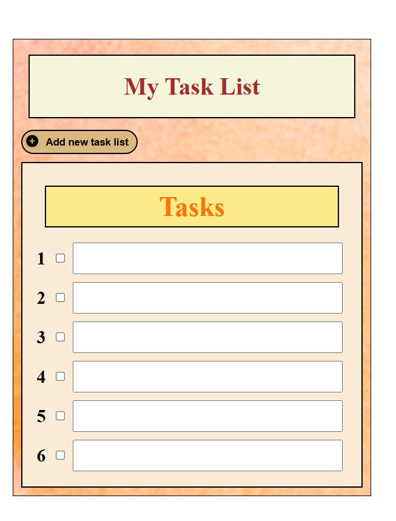

# To-Do List 📋

A simple, elegant, and customizable To-Do List website created using **HTML**, **CSS**, and **Font Awesome** icons. 
This project allows users to keep track of tasks with ease, enhancing productivity in a visually pleasing environment.

## Features ✨

- **Add Task Button**: Easily add new tasks.
- **Task List**: View a numbered list of tasks.
- **Checkboxes**: Mark tasks as completed.
- **Customizable Text Area**: Each task has a dedicated text area for descriptions or notes.

## Preview 🌟



> **Note**: The screenshot provides an example of the To-Do List layout.

## Technologies Used 🛠️

- **HTML**: Structure of the webpage.
- **CSS**: Styling and layout.
- **Font Awesome**: Icon library for the add task button.

## How to Use 🚀

1. Clone this repository:
   ```bash
   git clone https://github.com/SourajeetOfficial/To-Do-List-CSS-Only.git
   ```

2. Navigate to the project folder:
   ```bash
   cd To-Do-List-CSS-Only
   ```

3. Open the `index.html` file in your browser to view and interact with the To-Do List.

## Project Structure 📂

- **index.html** - Main HTML file with task list structure.
- **style.css** - Contains all styling for layout and components.
- **background.jpg** - Background image for the To-Do List.
- **sample.png** - Sample screenshot of the To-Do List.

## Customization 🎨

Feel free to customize the following:
- **Background Image**: Replace `background.jpg` with any image of your choice.
- **Colors and Fonts**: Modify `style.css` to adjust colors, fonts, and sizes.
- **Task Items**: Add more tasks as needed by duplicating the existing task structure in HTML.

## License 📜

This project is open-source and wholly created by the author.

---

Enjoy organizing your tasks with style! 📝
